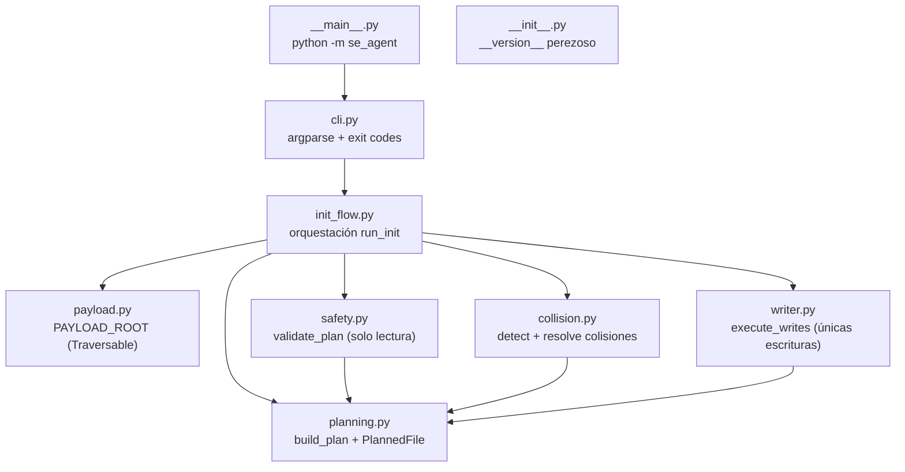
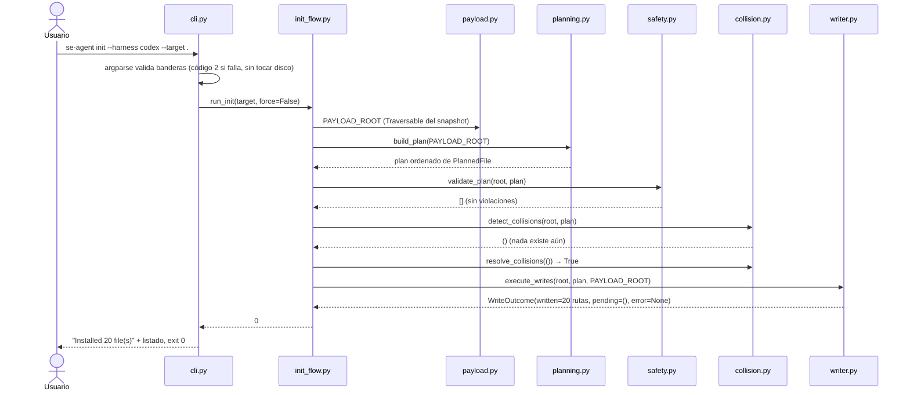
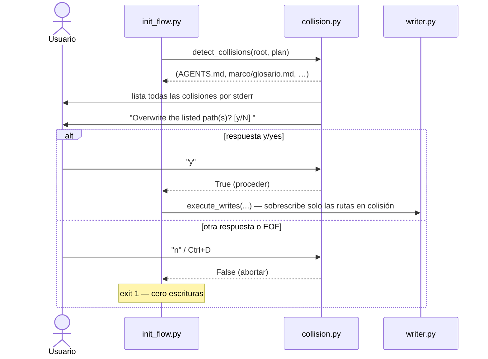
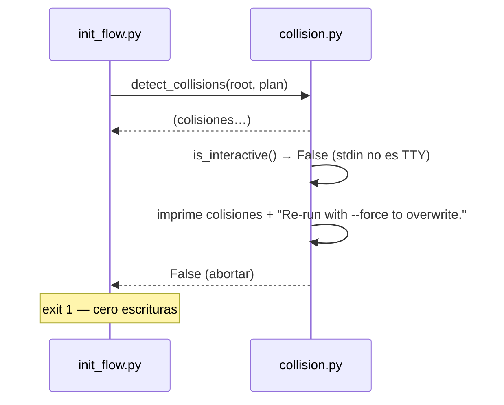
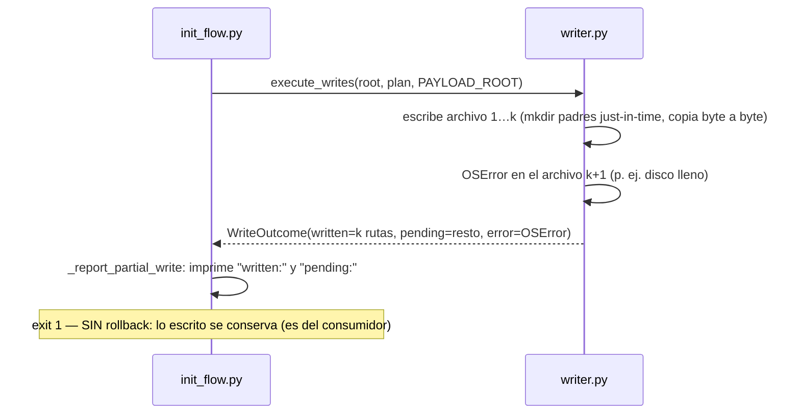
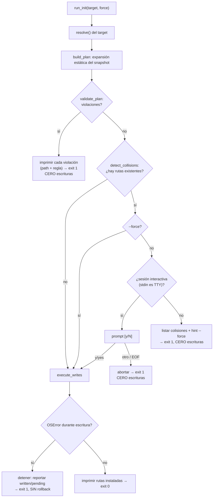
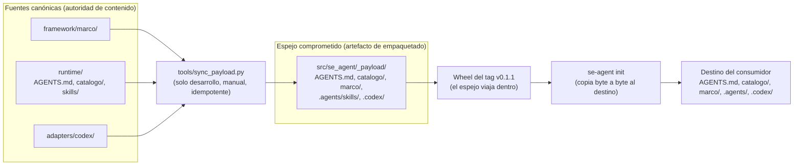

# Arquitectura de Python — paquete `se_agent`

Este manual explica la arquitectura interna del paquete Python `se_agent` (CLI `se-agent`) a un nivel básico: cómo está organizado, cómo fluye una ejecución de principio a fin, qué hace cada función, clase, tipo y constante, y **por qué** está diseñado así. No asume experiencia previa con empaquetado Python: cada concepto nuevo (entry point, wheel, `Traversable`, dataclass, etc.) se explica donde aparece.

> **Alcance.** Documenta el paquete tal como está en la versión **0.1.1** (tag `v0.1.1`). La autoridad de requisitos es el [PRD 1](prd/prd-001-one-shot-codex-scaffolder.md); la autoridad de producto es [`architecture/product.md`](architecture/product.md). Aquí se describe la implementación.

## Historial de cambios

| Versión del documento | Fecha      | Cambios                                                                                                                                                                                              |
| ---------------------- | ---------- | ---------------------------------------------------------------------------------------------------------------------------------------------------------------------------------------------------- |
| 1.0.0                  | 2026-08-31 | Primera versión: layout de build, mapa de módulos, secuencias, decisiones de seguridad, referencia completa de la API, conceptos Python, racionalidad e invariantes. Compatible con paquete 0.1.1. |

---

## Cómo leer este documento (ruta de lectura para junior)

1. **Primero:** la [visión general](#visión-general) y el [mapa de módulos](#mapa-de-módulos-y-dependencias). Con eso ya sabe "dónde vive cada cosa".
2. **Segundo:** las [secuencias end-to-end](#secuencias-end-to-end) y el [diagrama de decisiones](#decisiones-de-seguridad-colisión-y-escritura). Con eso entiende el flujo en ejecución.
3. **Tercero:** el [modelo del payload](#modelo-del-payload-fuente-canónica-vs-espejo-empaquetado).
4. **Después, bajo demanda:** la [referencia de módulos y API](#referencia-de-módulos-y-api), sección por sección, siempre con el código al lado (`src/se_agent/*.py`).
5. **Para cerrar:** [conceptos de Python explicados](#conceptos-de-python-explicados), [racionalidad e invariantes](#racionalidad-de-diseño-e-invariantes) y [no-objetivos](#no-objetivos).

Consejo: las funciones con guion bajo inicial (`_walk`, `_default_prompt`, …) son **internas** del módulo: detalles de implementación que no forman parte de su contrato público, pero se documentan porque en un paquete pequeño ayudan a entender el todo.

---

## Visión general

`se-agent` es un **scaffolder one-shot**: un único comando `init` instala un conjunto de archivos declarado (el **payload**) en un proyecto destino y la herramienta termina. Los archivos instalados pasan a ser propiedad absoluta del consumidor. No hay manifiesto, ni actualizador, ni comandos `update`/`doctor`/`uninstall` propios.

Decisiones arquitectónicas que definen todo lo demás:

| Decisión                                                      | Consecuencia                                                                                                                                                                                               |
| -------------------------------------------------------------- | ---------------------------------------------------------------------------------------------------------------------------------------------------------------------------------------------------------- |
| **Cero dependencias en runtime** (`dependencies = []`) | Todo se implementa con la**librería estándar** de Python 3.12+: `argparse`, `pathlib`, `importlib`, `shutil`, `dataclasses`, `enum`, `stat`, `os`. No hay supply chain en runtime. |
| **Payload viaja dentro del paquete**                     | `init` es **offline** (RF-9): nada se descarga en runtime; los bytes son idénticos para un mismo tag (determinismo por tag).                                                                      |
| **Plan completo validado antes de la primera escritura** | Cualquier validación fallida ⇒**cero escrituras**. Se opta deliberadamente por fallar temprano y sin efectos.                                                                                      |
| **Sin rollback**                                         | Si una escritura falla a mitad de camino, lo ya escrito se conserva (es del consumidor) y se reporta`written:`/`pending:`. No se inventa una transacción que luego falla.                             |
| **Inyección por callables** para efectos colaterales    | El flujo acepta funciones inyectables (`is_interactive`, `prompt_yes_no`, `copy_file`, `stdout`, `stderr`), lo que hace el sistema testeable sin mocks mágicos ni parcheo global.               |

---

## Estructura del paquete y build

### Layout en el repositorio

El repositorio usa el **layout `src/`**: el código importable vive dentro de `src/`, lo que evita accidentalmente importar el paquete desde el directorio de desarrollo sin instalarlo (fuente clásica de bugs sutiles).

```text
systems-engineering-framework-agent/
├── pyproject.toml                # Metadatos del proyecto y configuración de build
├── src/
│   └── se_agent/                 # Paquete Python importable
│       ├── __init__.py           # __version__ perezoso (PEP 562)
│       ├── __main__.py           # python -m se_agent
│       ├── cli.py                # Interfaz de línea de comandos (argparse)
│       ├── init_flow.py          # Orquestación de los pasos de init
│       ├── payload.py            # Acceso al snapshot del payload (Traversable)
│       ├── planning.py           # Plan de escrituras determinista
│       ├── safety.py             # Preflight de seguridad de rutas (solo lectura)
│       ├── collision.py          # Detección y resolución de colisiones
│       ├── writer.py             # Escritor ordenado sin rollback
│       └── _payload/             # Snapshot del payload empaquetado (datos, no código)
│           ├── AGENTS.md
│           ├── catalogo/skill-registry.md
│           ├── marco/…           # 15 archivos del marco
│           ├── .agents/skills/f0_factibilidad/SKILL.md
│           └── .codex/{config.toml, agents/orchestrator.toml}
├── framework/                    # Fuente canónica del marco → se instala como marco/
├── runtime/                      # AGENTS.md, catalogo/, skills/ → raíz, catalogo/, .agents/skills/
├── adapters/codex/               # config.toml, agents/*.toml → .codex/
├── tools/sync_payload.py         # (dev) sincroniza fuentes canónicas → _payload/
└── tests/                        # unit/ + integration/ (pytest)
```

Nota: `_payload/` es un **directorio de solo datos** (sin `__init__.py`); Python lo trata como subpaquete de espacio de nombres, y eso es exactamente lo que permite leerlo con `importlib.resources` sin importar código desde él.

### `pyproject.toml` explicado

```toml
[build-system]
requires = ["hatchling>=1.24"]     # Frontend de build usa hatchling
build-backend = "hatchling.build"

[project]
name = "se-agent"                  # Nombre de la distribución (pipx/pip)
version = "0.1.1"                  # Fuente única de la versión
requires-python = ">=3.12"         # Mínimo soportado
dependencies = []                  # Cero dependencias en runtime

[project.scripts]
se-agent = "se_agent.cli:main"     # Entry point: crea el comando `se-agent`

[tool.hatch.build.targets.wheel]
packages = ["src/se_agent"]        # Qué se mete en el wheel
```

Puntos clave para un junior:

- **`[project.scripts]` define el entry point**: al instalar el paquete, el instalador genera un ejecutable llamado `se-agent` que, cuando usted lo invoca, importa `se_agent.cli` y llama a su función `main()`. Ese es todo el truco detrás de "el comando existe".
- **Un wheel** es el formato estándar de distribución de Python: un ZIP con el paquete y sus metadatos, que pip/pipx despliega en `site-packages` (o en el entorno aislado de pipx). `python -Im build --wheel` lo produce; pipx lo instala.
- **`version = "0.1.1"` es la fuente única**: CI compara el tag `vX.Y.Z` contra este campo, y `se-agent --version` lee la versión de los **metadatos instalados** (`importlib.metadata`), así que las tres cifras coinciden por construcción.

### Dos formas de instalar el paquete

| Forma                             | Qué pasa                                                                                                                                             |
| --------------------------------- | ----------------------------------------------------------------------------------------------------------------------------------------------------- |
| `pipx install <zip-de-tag>`     | pipx instala el paquete en**su propio entorno virtual aislado** y expone solo el comando `se-agent` en el `PATH`. Es la vía de usuario.    |
| `pip install -e .` (desarrollo) | Instalación*editable*: `site-packages` apunta a `src/` del repositorio. Útil para desarrollar; los cambios en `src/` se ven sin reinstalar. |

---

## Mapa de módulos y dependencias



La dirección de dependencias es estricta y deliberada (flecha = "importa a"):

- `cli` solo conoce `init_flow`. Todo lo demás es invisible para la interfaz.
- `init_flow` es el **único** módulo que importa a casi todos; es el orquestador.
- `payload` es la capa más baja: **no importa código que escriba al disco**, y nadie tiene permiso de importarlo "al revés". Los demás módulos reciben el `Traversable` del payload como parámetro, no lo descubren solos (excepto `init_flow`, que lo pasa).
- `safety`, `collision` y `writer` solo conocen el modelo `PlannedFile` de `planning`. Cada uno tiene **una** responsabilidad y **ninguno** decide el flujo.

Regla de oro del diseño: **solo `writer` escribe en el disco**. Todo lo anterior es lectura o cálculo puro.

---

## Secuencias end-to-end

### Camino feliz: `init` sin colisiones



Puntos que conviene fijarse:

- El plan se construye **una vez**, por expansión estática del snapshot: ningún input del usuario contribuye a una ruta del plan.
- La validación de seguridad (`validate_plan`) es **pura**: lee con `lstat`/`lexists` pero no escribe nunca ("no probe writes").
- Solo después de plan + preflight + colisiones resueltas ocurre la primera escritura.

### Colisión: sesión interactiva



La decisión completa se toma **antes** de escribir el primer byte, así que un aborto tras el prompt es **cero-escrituras por construcción**.

### Colisión: sesión no interactiva (sin TTY)



Con `--force`, este camino ni siquiera pregunta: procede directamente, sobrescribiendo exactamente las rutas del write-set en colisión.

### Fallo a mitad de escritura



El reporte dice explícitamente que los archivos ya escritos **no se revierten** y que re-ejecutar `init` los tratará como colisiones.

---

## Decisiones de seguridad, colisión y escritura



### El orden es el contrato

Cada bloque ocurre **estrictamente después** del anterior y ninguna escritura ocurre antes del paso 6:

1. Resolución del target (`Path(target).resolve()`).
2. Construcción del plan estático.
3. Preflight de seguridad completo.
4. Detección de **todas** las colisiones.
5. Resolución de colisiones (force / prompt / abort).
6. Escrituras ordenadas.
7. Reporte.

### Por qué `--force` no es peligroso

- La lista de colisiones proviene de la intersección "plan ∩ ya existe": **por construcción solo puede contener rutas del write-set**. `--force` no puede ganar privilegios extra porque no hay nada fuera del write-set a lo que aplicarse.
- El preflight de seguridad **nunca** se relaja: `--force` se entrega a la etapa de colisiones solamente (REQ-W4). Rutas absolutas, `..` que escapen y symlinks que apunten fuera del destino se rechazan igual con o sin force.
- `proyecto/` y cualquier contenido ajeno al payload son intocables por diseño: el plan ni siquiera contiene rutas que no sean del write-set.

### Reglas del preflight (`safety.py`), en orden por destino

| # | Regla                            | Constante                               | Qué rechaza                                                                                                                    |
| - | -------------------------------- | --------------------------------------- | ------------------------------------------------------------------------------------------------------------------------------- |
| 1 | Sanidad del path del plan        | `absolute-path`, `parent-reference` | Destinos absolutos o con`..` (inalcanzables por construcción; defensa en profundidad).                                       |
| 2 | Escapatoria por symlink ancestro | `symlink-escape`                      | Un componente ancestro existente es symlink y su`resolve()` queda fuera del target.                                           |
| 3 | Destino symlink                  | `symlink-destination`                 | La ruta destino existe y es symlink (incluye symlinks rotos, por`lstat`): **nunca** se escribe a través de un symlink. |
| 4 | Ancestro no directorio           | `parent-not-directory`                | Un ancestro existe como archivo regular.                                                                                        |
| 5 | Raíz inválida                  | `root-not-directory`                  | El target no existe o no es directorio.                                                                                         |

Las violaciones son deterministas: se ordenan por `(path, rule)` y cada una nombra la ruta ofensora.

---

## Modelo del payload: fuente canónica vs espejo empaquetado

El payload tiene **dos representaciones con roles distintos**:



- **Fuente canónica**: `framework/`, `runtime/`, `adapters/`. Si quiere cambiar el contenido del marco, edite aquí.
- **Espejo**: `src/se_agent/_payload/`. Es la copia exacta que viaja dentro del wheel. No se edita a mano: se regenera con `python tools/sync_payload.py` (script determinista e idempotente, **solo desarrollo**).
- **Coherencia probada**: `tests/unit/test_payload_coherence.py` demuestra byte a byte que espejo == fuentes. CI ejecuta esa verificación pero **nunca** ejecuta `sync_payload.py` ni modifica el repositorio (CI probadamente read-only: snapshot `git status` completo antes/después del run).
- **Mapeo fuente→destino** (misma estructura relativa, con renombres de prefijo): `framework/marco/` → `marco/`, `runtime/skills/` → `.agents/skills/`, `adapters/codex/` → `.codex/`, `runtime/AGENTS.md` → `AGENTS.md`, `runtime/catalogo/` → `catalogo/`. El write-set total del tag `v0.1.1` son **20 archivos**.
- **Consecuencia clave**: dado el mismo tag, dos ejecuciones de `init` sobre destinos equivalentes producen **bytes idénticos** (determinismo por tag, RNF-5), y `init` funciona **sin red** (todo viaja en el paquete).

---

## Referencia de módulos y API

Referencia completa del código en `src/se_agent/*.py`. Para cada elemento: firma, responsabilidad, entradas, salidas, efectos colaterales, modos de fallo y quién lo llama.

> **Nota sobre las etiquetas `REQ-*`.** Las etiquetas `REQ-*` que aparecen en esta referencia (por ejemplo `REQ-C3`, `REQ-W4`) son **identificadores internos de trazabilidad entre código y tests** de este paquete: nombran el requisito que motiva cada comportamiento, pero **no** son identificadores del PRD. La autoridad de requisitos sigue siendo el [PRD 1](prd/prd-001-one-shot-codex-scaffolder.md), que usa sus propios IDs `RF`/`RNF`/`AC`. Al consultar el PRD, localice el requisito por su contenido y criterio de aceptación, no por el código `REQ-*`.

### `__init__.py` — identidad del paquete

#### `__all__ = ["__version__"]`

- **Qué es:** constante que declara la API pública del módulo.
- **Responsabilidad:** documentar que lo único exportado es `__version__`.

#### `__getattr__(name: str)`

- **Firma:** `def __getattr__(name: str) -> str` (solo resuelve `"__version__"`).
- **Responsabilidad:** atributo de módulo **perezoso** (PEP 562): `__version__` no se calcula al importar sino al acceder. Devuelve `importlib.metadata.version("se-agent")`.
- **Entradas:** nombre del atributo solicitado.
- **Salidas:** la versión SemVer de la distribución instalada (sin prefijo `v`).
- **Efectos colaterales:** ninguno (lectura de metadatos).
- **Modos de fallo:** `importlib.metadata.PackageNotFoundError` si el paquete no está instalado — **deliberadamente** sin string de fallback dev: si no hay metadatos, no hay versión verificable.
- **Llamado por:** cualquier `import se_agent; se_agent.__version__` y los tests de versión.

> Concepto PEP 562: los módulos Python pueden definir `__getattr__` a nivel de módulo; Python lo invoca solo cuando el atributo no se encontró por la vía normal. Permite atributos "calculados al vuelo".

### `__main__.py` — entrada `python -m se_agent`

#### Bloque `if __name__ == "__main__":`

- **Responsabilidad:** permitir `py -m se_agent …` como alternativa al comando `se-agent`. Importa `main` de `cli` y hace `sys.exit(main())`.
- **Efectos colaterales:** los de `main`.
- **Modos de fallo:** los de `main` (propaga el código de salida).
- **Llamado por:** el intérprete cuando se ejecuta `python -m se_agent`.

> Concepto: un módulo ejecutado con `-m` obtiene `__name__ == "__main__"`. Es el patrón estándar de punto de entrada secundario.

### `cli.py` — interfaz de línea de comandos

#### `class ExitCode(enum.IntEnum)`

- **Miembros:** `OK = 0`, `OPERATIONAL_ERROR = 1`, `USAGE_ERROR = 2`, `INTERRUPTED = 130`.
- **Responsabilidad:** mapeo único de códigos de salida (D5). Al ser `IntEnum`, sus miembros son ints usables directamente como valor de retorno/`sys.exit`.
- **Concepto:** `enum.IntEnum` es una enumeración cuyos miembros son enteros comparables; evita "números mágicos" dispersos.

#### `HARNESS_CHOICES: tuple[str, ...] = ("codex",)`

- **Qué es:** constante pública; el único valor aceptado por `--harness` en el MVP (REQ-V2).
- **Consumida por:** `build_parser` (como `choices`) y por los tests de parseo.

#### `_print_version() -> None`

- **Responsabilidad:** imprimir la versión instalada a **stdout**, sin prefijo `v`.
- **Efectos colaterales:** escritura a stdout, o a stderr + `SystemExit(1)` en fallo.
- **Modos de fallo:** `PackageNotFoundError` ⇒ imprime `"se-agent: error: package 'se-agent' is not installed; cannot determine version (no fallback version is used)."` a stderr y sale con código 1. Nunca imprime una versión de desarrollo de reserva (D2).
- **Llamado por:** `main` cuando se pasa `--version`.

#### `build_parser() -> argparse.ArgumentParser`

- **Responsabilidad:** construir la superficie argparse (D3): bandera global `--version` y subcomando `init` con `--harness {codex}` (requerido), `--target` (requerido) y `--force` (flag).
- **Entradas:** ninguna (la superficie es estática).
- **Salidas:** el parser configurado.
- **Efectos colaterales:** ninguno: **el parseo nunca toca el sistema de archivos** (REQ-V2), garantizando que un error de uso sea siempre cero-escrituras.
- **Modos de fallo:** argparse hace `SystemExit(2)` ante errores de sintaxis.
- **Llamado por:** `main`; también por `tests/unit/test_cli_parse.py` para probar el parseo sin ejecutar nada.

#### `_run_init(args: argparse.Namespace) -> int`

- **Responsabilidad:** puente del namespace ya validado hacia `run_init(target, force=args.force)`.
- **Garantía:** `--force` se entrega **solo** al paso de colisiones; jamás relaja el preflight (REQ-W4).
- **Llamado por:** `main`.

#### `main(argv: Sequence[str] | None = None) -> int`

- **Responsabilidad:** punto de entrada del CLI (conectado al entry point del paquete). Parsea, atiende `--version`, despacha `init`, y mapea `KeyboardInterrupt` a código 130 con mensaje que aclara que la garantía de cero escrituras solo vale antes de la primera escritura.
- **Entradas:** `argv` (por defecto `sys.argv[1:]`); inyectable para tests.
- **Salidas:** código de salida int (`0`, `1`, `2` implícito vía `SystemExit` de argparse, o `130`).
- **Efectos colaterales:** los de la rama ejecutada (imprimir versión o ejecutar `init`).
- **Modos de fallo:** sin comando ⇒ `parser.error(...)` ⇒ salida 2. `KeyboardInterrupt` dentro de `init` ⇒ 130.
- **Llamado por:** el entry point `[project.scripts]`, `__main__.py`, y los tests.

### `init_flow.py` — orquestación

#### `run_init(target: str, *, force: bool = False, is_interactive: IsInteractive | None = None, prompt_yes_no: PromptYesNo | None = None, copy_file: CopyFile | None = None, stdout: TextIO | None = None, stderr: TextIO | None = None) -> int`

- **Responsabilidad:** ejecutar la secuencia normativa completa (diseño §4, pasos 3–9): resolver target → construir plan → preflight → detectar colisiones → resolverlas → escribir → reportar.
- **Entradas:** `target` (ruta del destino como texto); inyecciones opcionales para tests (ver [seams](#costuras-de-prueba-testing-seams)).
- **Salidas:** código de salida del CLI (`0` éxito; `1` en cualquier fallo operacional).
- **Efectos colaterales:** mensajes por stderr/stdout; **escrituras al disco solo vía `execute_writes`** y solo si todo lo anterior pasó.
- **Modos de fallo:** violaciones de preflight ⇒ imprime `se-agent: error: <path>: violated rule '<rule>'` por cada una y `return 1` (cero escrituras). Colisiones no resueltas ⇒ `return 1` (cero escrituras). Fallo de escritura ⇒ `_report_partial_write` y `return 1`.
- **Garantías:** ningún byte del destino se toca antes de validar el plan completo (REQ-F1); éxito (0) implica cero escrituras pendientes (REQ-M2); cada fallo nombra un archivo o una regla (REQ-F3).
- **Llamado por:** `cli._run_init`; los tests de integración lo llaman directamente con seams inyectados.

#### `_report_partial_write(outcome: WriteOutcome, error: OSError, err: TextIO) -> None`

- **Responsabilidad:** reporte de escritura parcial (REQ-M1/M2): imprime el error, el bloque `written:` y el bloque `pending:`, y la nota de que no hay rollback y que re-ejecutar convertirá lo escrito en colisiones.
- **Entradas:** el `WriteOutcome` con listas escritas/pendientes, el `OSError` original, el stream de salida.
- **Efectos colaterales:** escritura a `err`.
- **Modos de fallo:** ninguno propio (función de reporte).
- **Llamado por:** `run_init`.

### `payload.py` — acceso al snapshot

#### `PAYLOAD_ROOT: Traversable`

- **Qué es:** constante pública; raíz del snapshot `_payload/` resuelta **una vez** al importar el módulo.
- **Responsabilidad:** punto único de acceso al payload para `init_flow`, tests y herramientas.
- **Modos de fallo:** la resolución ocurre al importar; si la instalación estuviera corrupta, el import falla (fallo temprano y visible).
- **Consumida por:** `init_flow.run_init` (para planear y para copiar), tests de integración.

#### `_payload_root() -> Traversable`

- **Responsabilidad:** resolver `importlib.resources.files("se_agent._payload")`. Funciona igual para la instalación editable (apunta a `src/`) que para la instalada desde wheel (apunta a `site-packages`), porque `_payload` es un directorio de datos importable como subpaquete de espacio de nombres (sin `__init__.py`).
- **Concepto `Traversable`:** objeto con una interfaz mínima tipo-archivo (`iterdir()`, `is_dir()`, `open()`, `joinpath()`…) que funciona **tenga el paquete donde tenga**: en un directorio, o dentro de un ZIP. Así el payload se lee igual instalado desde wheel que editable.
- **Llamado por:** la inicialización de `PAYLOAD_ROOT`.

#### `enumerate_payload() -> tuple[tuple[PurePosixPath, PurePosixPath], ...]`

- **Responsabilidad:** enumerar los candidatos del payload como pares `(dest_rel, payload_rel)` de `PurePosixPath` (destino-preservante: son iguales), ordenados lexicográficamente por las partes del destino.
- **Salidas:** tupla inmutable de pares.
- **Efectos colaterales:** ninguno (solo lectura del Traversable).
- **Llamado por:** `tests/unit/test_planning.py` y `tests/integration/test_collisions.py` como **oráculo** que comprueba que `build_plan` y la enumeración del payload coinciden.

> Relación `payload` ↔ `planning`: `build_plan` hace su propio recorrido del Traversable y `enumerate_payload` existe como oráculo independiente de tests. Ambos deben producir el mismo conjunto; un test lo verifica.

### `planning.py` — el plan determinista

#### `@dataclass(frozen=True, order=True) class PlannedFile`

- **Campos:** `dest_rel: PurePosixPath` (relativa a la raíz del target), `payload_rel: PurePosixPath` (relativa a la raíz del snapshot).
- **Responsabilidad:** modelo inmutable de **una** escritura planificada.
- **Concepto dataclass:** `@dataclass` genera `__init__`, `__repr__` y `__eq__` automáticamente. `frozen=True` hace instancias inmutables (no se pueden alterar tras crearse: el plan no puede "moverse" por accidente) y `order=True` genera comparaciones `<`/`>` campo a campo, útiles para ordenar y comparar planes en tests.
- **Consumida por:** todos los módulos posteriores; es la moneda común del pipeline.

#### `build_plan(payload_root: Traversable) -> tuple[PlannedFile, ...]`

- **Responsabilidad:** expandir el payload en el plan completo, **ordenado** por la tupla de `dest_rel.parts` (lexicográfico por partes). El orden es estable entre ejecuciones, plataformas y orden de enumeración del sistema de archivos — de ahí la determinismo de los reports y del árbol resultante.
- **Entradas:** el Traversable del snapshot.
- **Salidas:** tupla inmutable de `PlannedFile` ya verificada por `_assert_write_set`.
- **Efectos colaterales:** ninguno (lectura pura).
- **Modos de fallo:** `AssertionError` si `_assert_write_set` detecta un path no sanitario ( unreachable por construcción; indicaría un bug).
- **Llamado por:** `init_flow.run_init`; tests de planificación e integración.

#### `_walk(traversable: Traversable, prefix: tuple[str, ...], out: list[...]) -> None`

- **Responsabilidad:** recorrido recursivo del snapshot acumulando las partes de ruta de cada archivo. Interna, sin estado global.
- **Llamado por:** `build_plan`.

#### `_assert_write_set(plan: tuple[PlannedFile, ...]) -> None`

- **Responsabilidad:** defensa en profundidad: verificar que cada destino es relativo y sin `..`. "Unreachable by construction" (el plan nace de una expansión estática); si falla, es un bug y explota ruidosamente.
- **Modos de fallo:** `AssertionError("unsanitary plan path: …")`.
- **Llamado por:** `build_plan` (última línea).

### `safety.py` — preflight de seguridad (solo lectura)

#### Constantes de reglas

`RULE_ABSOLUTE = "absolute-path"`, `RULE_PARENT_REFERENCE = "parent-reference"`, `RULE_SYMLINK_ESCAPE = "symlink-escape"`, `RULE_SYMLINK_DESTINATION = "symlink-destination"`, `RULE_PARENT_NOT_DIRECTORY = "parent-not-directory"`, `RULE_ROOT_NOT_DIRECTORY = "root-not-directory"`.

- **Qué son:** los nombres exactos de regla que aparecen en los mensajes de error (`violated rule '<rule>'`). Constantes en vez de strings sueltos para evitar typos y permitir tests exactos.

#### `@dataclass(frozen=True, order=True) class Violation`

- **Campos:** `path: str`, `rule: str`.
- **Responsabilidad:** una rechazo nombrado del preflight: qué ruta violó qué regla. `order=True` permite `sorted()` determinista por `(path, rule)`.

#### `validate_plan(root: Path, plan: Iterable[PlannedFile]) -> list[Violation]`

- **Responsabilidad:** validar el plan completo contra el target **antes de escribir nada**. Aplica las 5 reglas en orden por destino (ver tabla en [Decisiones de seguridad](#decisiones-de-seguridad-colisión-y-escritura)).
- **Entradas:** `root` (raíz destino; se hace `.resolve()` dentro), `plan`.
- **Salidas:** lista (posiblemente vacía) de `Violation`, ordenada.
- **Efectos colaterales:** **ninguno**: solo lee mediante `os.path.lexists`, `os.lstat`, `Path.is_dir()` y `Path.resolve()`. Sin "probe writes", sin tests de escritura (D4: la escribibilidad solo la valida el bucle real de escritura).
- **Modos de fallo:** no lanza; devuelve violaciones. El llamador decide abortar.
- **Por qué `lstat` y no `stat`:** `lstat` no sigue el symlink final, lo que permite detectar symlinks (incluso rotos) sin atravesarlos. Nunca se escribe a través de un symlink: si el destino es symlink, regla dura, sin importar hacia dónde apunte.
- **Llamado por:** `init_flow.run_init` (paso 5); tests unitarios `test_safety.py`.

#### `_check_destination(root: Path, dest: PurePosixPath, violations: list[Violation]) -> None`

- **Responsabilidad:** recorrer la cadena de ancestros del destino desde `root` hacia abajo: sigue symlinks internos **solo después** de probar que su `resolve()` queda dentro de `root`; se detiene en el primer componente inexistente (nada por debajo existe aún); marca escapes de symlink, destinos symlink y ancestros no-directorio.
- **Detalle importante:** el destino que existe como **archivo regular** no es "inseguro": es una **colisión** (la maneja `collision.py`). La seguridad y las colisiones son preocupaciones separadas.
- **Llamado por:** `validate_plan`.

#### `_is_inside(root: Path, resolved: Path) -> bool`

- **Responsabilidad:** predicado "¿esta ruta resuelta queda dentro de la raíz (o es la raíz)?" usando `Path.is_relative_to`. Interna, puro.

### `collision.py` — colisiones (detección y decisión)

#### `ACCEPTED_ANSWERS: frozenset[str] = frozenset({"y", "yes"})`

- **Qué es:** constante pública; las únicas respuestas que proceden en el prompt (REQ-C3), comparadas en minúsculas tras `strip`.

#### `FORCE_HINT = "Re-run with --force to overwrite."`

- **Qué es:** constante pública; sugerencia exacta incluida en el aborto no interactivo (REQ-C4).

#### Tipos inyectables: `IsInteractive` y `PromptYesNo`

- **Declaración:** `IsInteractive = Callable[[], bool]`; `PromptYesNo = Callable[[str], "str | None"]`.
- **Qué son:** alias de tipo sobre `Callable` que describen las **costuras** (seams) del protocolo de colisiones: qué función decide "¿hay TTY?" y qué función hace la pregunta. No son clases ni `Protocol`s formales: en un paquete sin dependencias, un alias de `Callable` con firma clara cumple el mismo papel (inyección de comportamiento) con menos maquinaria.
- **Concepto:** la **inyección de callables** es el patrón de diseño central del paquete: en vez de que el módulo decida cómo leer la TTY o cómo copiar archivos, recibe esas funciones como parámetros. En producción se usan los defaults; en tests, dobles de prueba triviales.

#### `detect_collisions(root: Path, plan: Iterable[PlannedFile]) -> tuple[PurePosixPath, ...]`

- **Responsabilidad:** devolver la lista **completa** de destinos del plan que ya existen (REQ-C1), calculada **antes** de la primera escritura.
- **Mecanismo:** `os.path.lexists` — a diferencia de `exists`, no sigue el symlink: detecta también symlinks **rotos** como colisiones.
- **Garantía estructural:** toda colisión es, por construcción, miembro del write-set. Por eso `--force` no puede otorgar privilegios extra (REQ-C5/REQ-W4).
- **Efectos colaterales:** ninguno (lectura pura).
- **Llamado por:** `init_flow.run_init` (paso 6).

#### `resolve_collisions(collisions: Iterable[PurePosixPath], *, force: bool, is_interactive: IsInteractive, prompt_yes_no: PromptYesNo, stderr: TextIO) -> bool`

- **Responsabilidad:** decidir si proceder sobre las colisiones listadas — **antes** de cualquier escritura. Semántica exacta: sin colisiones ⇒ `True`; `force` ⇒ `True`; interactivo ⇒ lista todas por stderr y pregunta `[y/N]`, solo `y`/`yes` (case-insensitive, `strip`) procede, cualquier otra respuesta o EOF aborta (REQ-C3); no interactivo sin force ⇒ lista todas + `FORCE_HINT` y aborta (REQ-C4).
- **Salidas:** `True` proceder / `False` abortar.
- **Efectos colaterales:** escritura de mensajes a `stderr` y, en interactivo, lectura de una línea de `stdin` (vía el callable inyectado).
- **Llamado por:** `init_flow.run_init` (paso 7); tests `test_collisions.py` y `test_force.py` con seams falsos.

#### `_print_collisions(collisions: Iterable[PurePosixPath], stderr: TextIO) -> None`

- **Responsabilidad:** imprimir cada colisión como `se-agent: collision: <ruta posix>`. Interna.

#### `_default_is_interactive() -> bool`

- **Responsabilidad:** seam por defecto (D5): la sesión es interactiva si `sys.stdin.isatty()`.
- **Llamado por:** `run_init` cuando no se inyecta `is_interactive`.

#### `_default_prompt(prompt: str) -> str | None`

- **Responsabilidad:** seam por defecto (D5): imprime el prompt por **stderr** y lee una línea de stdin. Devuelve `None` en EOF (readline vacía), lo que aborta (REQ-C3).
- **Por qué stderr:** mantener stdout limpio para la salida contractual (el listado de archivos instalados); stderr es el canal de diagnóstico/interacción, redirigible sin contaminar el resultado.

### `writer.py` — escritura ordenada (único módulo que escribe)

#### `CopyFile = Callable[[Traversable, PlannedFile, Path], None]`

- **Qué es:** alias público del tipo de la costura de copia. Inyectar `copy_file` permite simular fallos de escritura (REQ-M1) sin depender de permisos reales del sistema.

#### `@dataclass(frozen=True) class WriteOutcome`

- **Campos:** `written: tuple[PurePosixPath, ...]`, `pending: tuple[PurePosixPath, ...]`, `error: OSError | None`.
- **Responsabilidad:** reporte inmutable del bucle de escritura. El contrato de éxito se verifica con datos, no con confianza: `error is None` y `pending == ()` ⇒ éxito real (y `init_flow` sale distinto de 0 siempre que `error` esté presente — REQ-M2).

#### `execute_writes(root: Path, plan: Sequence[PlannedFile], payload_root: Traversable, copy_file: CopyFile | None = None) -> WriteOutcome`

- **Responsabilidad:** escribir el plan ya validado en su orden determinista. Para cada ítem: `mkdir(parents=True, exist_ok=True)` de la carpeta padre (just-in-time, sobre la cadena ya validada) y copia **byte a byte** (`open("rb")` → `open("wb")` vía `shutil.copyfileobj`, sin metadatos; D11).
- **Entradas:** raíz destino, plan, raíz del payload, costura opcional de copia.
- **Salidas:** `WriteOutcome`.
- **Efectos colaterales:** **los únicos del paquete**: creación de directorios y archivos en el destino (más el posible mensaje de la costura inyectada).
- **Modos de fallo:** en el primer `OSError` se detiene: construye `pending` con todo el resto del plan (desde el ítem fallido inclusive), devuelve `written`/`pending`/`error`. **Sin rollback y sin borrados** (REQ-M1): lo ya escrito es del consumidor.
- **Precondición:** el plan debe estar ya validado por `validate_plan`; esta función no revalida nada (separación de responsabilidades).
- **Llamado por:** `init_flow.run_init` (paso 8); tests `test_partial_write.py` (inyectando fallos), `test_init_exact_tree.py` (comparando bytes).

---

## Conceptos de Python explicados

Recopilación de los conceptos que aparecen en el código, con dónde se usan:

| Concepto                                            | Dónde aparece                                           | Explicación corta                                                                                                                                                                                                                                                         |
| --------------------------------------------------- | -------------------------------------------------------- | -------------------------------------------------------------------------------------------------------------------------------------------------------------------------------------------------------------------------------------------------------------------------- |
| **Entry point**                               | `pyproject.toml` → `se-agent = "se_agent.cli:main"` | El instalador genera un comando ejecutable que llama a una función Python concreta. Es la conexión entre "comando en la terminal" y "función en el paquete".                                                                                                            |
| **Módulo / paquete**                         | `src/se_agent/`                                        | Un módulo es un archivo`.py`; un paquete es una carpeta de módulos. El `_` inicial en `_payload`, `_walk`, etc. señala "interno, no parte de la API pública".                                                                                                  |
| **`python -m`**                             | `__main__.py`                                          | Ejecutar un paquete como script: el intérprete busca`__main__.py` y lo corre con `__name__ == "__main__"`.                                                                                                                                                            |
| **`@dataclass`**                            | `PlannedFile`, `Violation`, `WriteOutcome`         | Genera constructor/`__repr__`/`__eq__` para clases de datos. `frozen=True` = inmutables (los datos del plan nunca cambian bajo tus pies); `order=True` = comparables y ordenables.                                                                                 |
| **`pathlib`**                               | `run_init`, `validate_plan`, `writer`              | API orientada a objetos de rutas:`Path` (ruta real del SO) vs `PurePosixPath` (ruta lógica sin tocar el disco). El write-set se define en **POSIX puro** (`PurePosixPath`), idéntico en Windows y Linux; la conversión a ruta real solo ocurre al escribir. |
| **Inyección de callables**                   | `run_init`, `resolve_collisions`, `execute_writes` | Recibir funciones como parámetros en vez de hardcodearlas: producción usa los defaults (`sys.stdin`, `shutil`), tests inyectan dobles. Equivale funcionalmente a un `Protocol`/interfaz, pero con tipos `Callable` simples, sin clases ni dependencias.          |
| **`importlib.resources` / `Traversable`** | `payload.py`                                           | Leer archivos empaquetados**dentro** del paquete instalado, sin asumir que son archivos reales en un directorio (podrían vivir dentro del wheel/ZIP). `Traversable` es la interfaz mínima que abstrae eso.                                                       |
| **stdout vs stderr**                          | `cli`, `init_flow`, `collision`                    | `stdout` es el **resultado** contractual (versión, listado de archivos instalados); `stderr` es diagnóstico y errores. Separarlos permite pipear la salida útil sin contaminarla con avisos.                                                                  |
| **Códigos de salida**                        | `ExitCode`, `main`                                   | Convención POSIX/Windows: 0 éxito, ≠0 fallo. Permite scripts/CI tomar decisiones sin parsear texto. Aquí: 0/1/2/130.                                                                                                                                                   |
| **Wheel**                                     | build y distribución                                    | ZIP estándar del paquete + metadatos; pipx lo despliega en el entorno aislado. Contiene el código**y** el espejo `_payload/` (por eso `init` es offline).                                                                                                      |
| **Cero dependencias runtime**                 | `dependencies = []`                                    | Todo con librería estándar: sin supply chain, sin resolución de versiones de terceros, instalación reproducible, superficie de ataque mínima.                                                                                                                         |
| **PEP 562 (atributos perezosos)**             | `__init__.py`                                          | `__getattr__` a nivel de módulo: `__version__` se resuelve de los metadatos instalados al momento de acceder, garantizando que lo impreso == instalado == `pyproject.toml`.                                                                                         |
| **`os.lstat` vs `stat`/`exists`**       | `safety`, `collision`                                | `lstat`/`lexists` **no siguen** el symlink final: permiten ver el enlace mismo (incluso roto) en lugar de su objetivo. Fundamental para no escribir a través de symlinks.                                                                                       |

---

## Racionalidad de diseño e invariantes

### Racionalidad (por qué está hecho así)

- **Un paquete pequeño y plano** (7 módulos de lógica más `__init__.py`/`__main__.py`, 9 archivos Python en total): el dominio es un flujo lineal; capas extra (plugins, configuración, abstracciones genéricas) serían peso muerto.
- **Validar todo antes de escribir** en lugar de transacciones/rollback: un rollback correcto es difícil (¿y si falla el rollback?) y la herramienta one-shot prefiere fallar temprano con cero efectos, o parar limpio dejando archivos que ya son del consumidor.
- **Colisiones como decisión explícita del usuario:** el marco no debe sobrescribir trabajo humano silenciosamente. El listado completo + `[y/N]`/`--force` pone la decisión en manos de quien es dueño del proyecto.
- **Plan estático sin input del usuario:** ninguna ruta depende de lo que teclee el usuario (más allá del target). Elimina por construcción toda una clase de inyecciones de ruta.
- **Seams inyectables en vez de mocks globales:** cada efecto colateral (TTY, prompt, copia, streams) entra como parámetro con valor por defecto de producción. Los tests no necesitan parchear `sys` ni `shutil`.
- **`PurePosixPath` para el write-set:** el paquete se instala también en Windows; definir los destinos en POSIX elimina diferencias de plataforma en plan, orden y reports.
- **Snapshot comprometido del payload** en vez de leer `framework/`/`runtime/` en runtime: el wheel instala solo `src/se_agent`, así que el paquete debe llevar sus datos consigo para ser offline y determinista por tag.

### Invariantes (verdades que siempre se cumplen)

1. Ninguna escritura ocurre antes de que el plan completo pase el preflight y las colisiones queden resueltas.
2. Exit 0 ⇒ todo el plan escrito, nada pendiente.
3. `--force` solo alcanza rutas del write-set que ya existen (la lista de colisiones es plan ∩ existentes).
4. Ninguna ruta del plan es absoluta ni contiene `..`; ningún destino se escribe a través de un symlink.
5. El orden de escrituras es determinista: tupla de partes del destino, lexicográfico.
6. `__version__` == metadatos instalados == `pyproject.toml` == tag; sin fallback dev.
7. La coherencia espejo `_payload/` == fuentes canónicas está probada por tests; CI nunca la repara, solo la verifica.

### Costuras de prueba (testing seams)

| Seam             | Parámetro                        | Default de producción          | Uso en tests                                                                |
| ---------------- | --------------------------------- | ------------------------------- | --------------------------------------------------------------------------- |
| ¿Hay terminal?  | `is_interactive: IsInteractive` | `sys.stdin.isatty()`          | Forzar modo interactivo/no interactivo.                                     |
| Prompt sí/no    | `prompt_yes_no: PromptYesNo`    | prompt en stderr + readline     | Responder`y`, `n`, EOF determinísticamente.                            |
| Copia de archivo | `copy_file: CopyFile`           | copia byte a byte con`shutil` | Inyectar`OSError` en el archivo k para probar escritura parcial (REQ-M1). |
| Streams          | `stdout`, `stderr: TextIO`    | `sys.stdout` / `sys.stderr` | Capturar reports sin redirigir el proceso.                                  |

Estructura de tests que explota estas costuras: `tests/unit/` (parseo, planificación, safety, coherencia payload/registry, versión) + `tests/integration/` (árbol exacto post-init, colisiones, force, escritura parcial, plan inválido). Total: 106 tests; cubren los 12 criterios de aceptación del PRD 1. CI corre la suite de forma **probadamente read-only** (snapshot `git status --porcelain=v1 --untracked-files=all --ignored=matching` vacío antes y después del run, con todo output mutable en `$RUNNER_TEMP`), y en el job de tags compara `vX.Y.Z` contra `pyproject.toml` sin construir nada. Los usuarios finales no ejecutan tests: son parte del desarrollo y del CI.

---

## No-objetivos

Lo que este paquete **deliberadamente no hace** (ver PRD 1 §3):

| No-objetivo                                                           | Razón                                                                                                                                                                                                |
| --------------------------------------------------------------------- | ----------------------------------------------------------------------------------------------------------------------------------------------------------------------------------------------------- |
| **Rollback / transaccionalidad**                                | Lo escrito ya es del consumidor; revertirlo sería destruir su propiedad. En su lugar: fallar temprano (cero escrituras) o parar limpio con reporte`written:`/`pending:`.                         |
| **Actualizador / manifiesto / hashes**                          | One-shot: tras`init` no hay estado gestionado, no hay `.framework-agent/`, no hay detección de deriva. Refrescar = re-ejecutar `init` (colisiones explícitas) o reinstalar otro tag con pipx. |
| **Comandos `update` / `doctor` / `uninstall`**            | No existen; el desinstalado es de pipx, la actualización es desinstalar + instalar el tag nuevo.                                                                                                     |
| **PyPI**                                                        | Distribución exclusivamente el ZIP del tag inmutable de GitHub (público) o el clon`git+ssh` del tag (privado).                                                                                    |
| **Múltiples harnesses**                                        | Solo`codex` en el MVP; los contratos de dominio permanecen harness-neutrales para el futuro.                                                                                                        |
| **Tocar `proyecto/` o cualquier archivo fuera del write-set** | Prohibición absoluta, incluso con`--force`.                                                                                                                                                        |

---

## Próximos pasos

- Para la experiencia de instalación y uso desde el punto de vista del usuario (Windows), lea [`manual-usuario.md`](manual-usuario.md).
- Para los requisitos formales y criterios de aceptación, [PRD 1](prd/prd-001-one-shot-codex-scaffolder.md).
- Para la arquitectura de producto y sus decisiones, [`architecture/product.md`](architecture/product.md).
