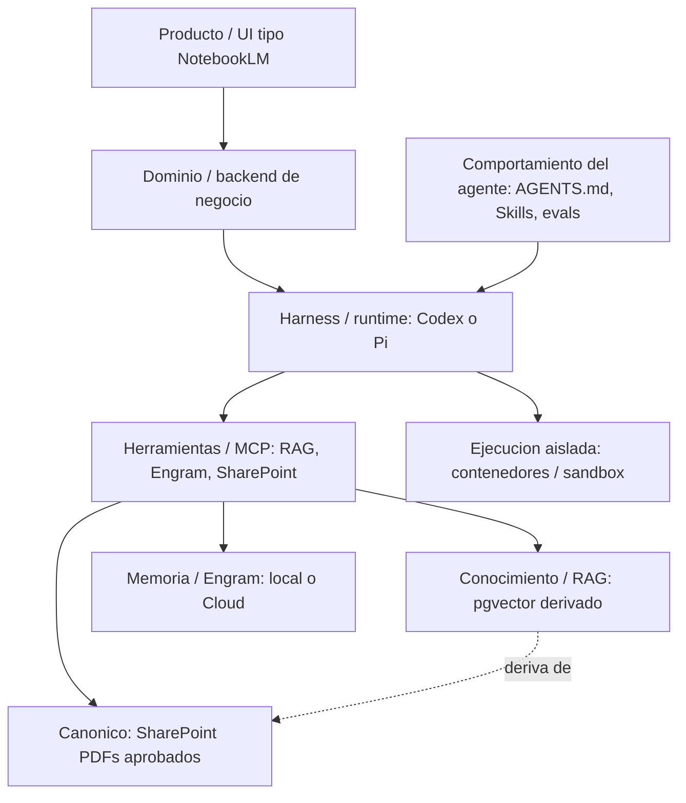
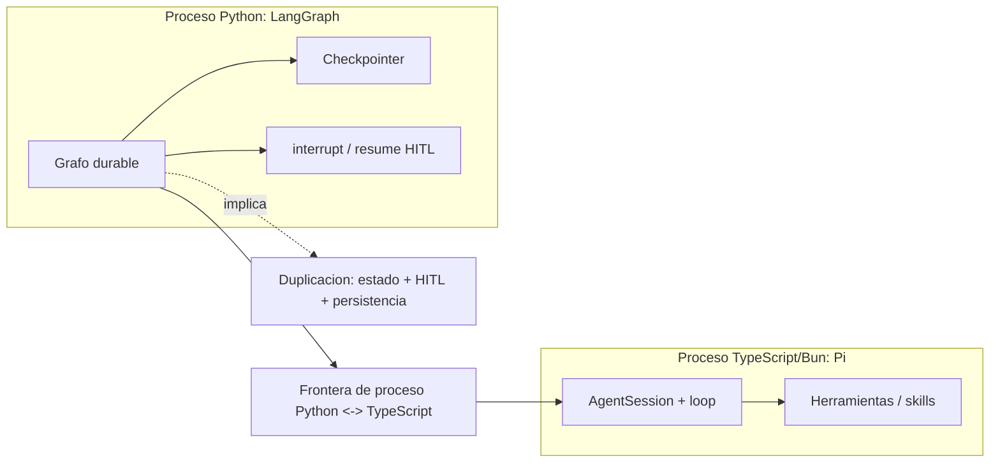
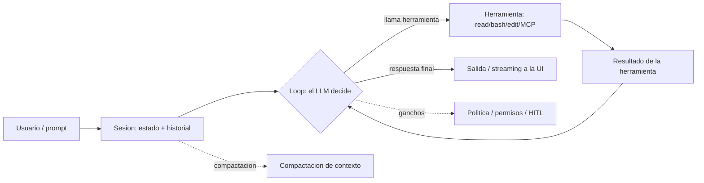
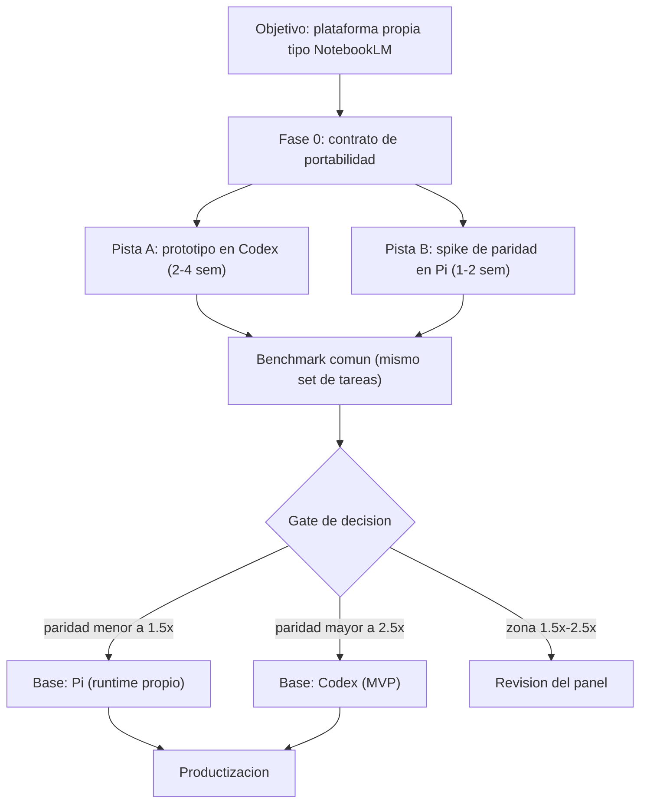
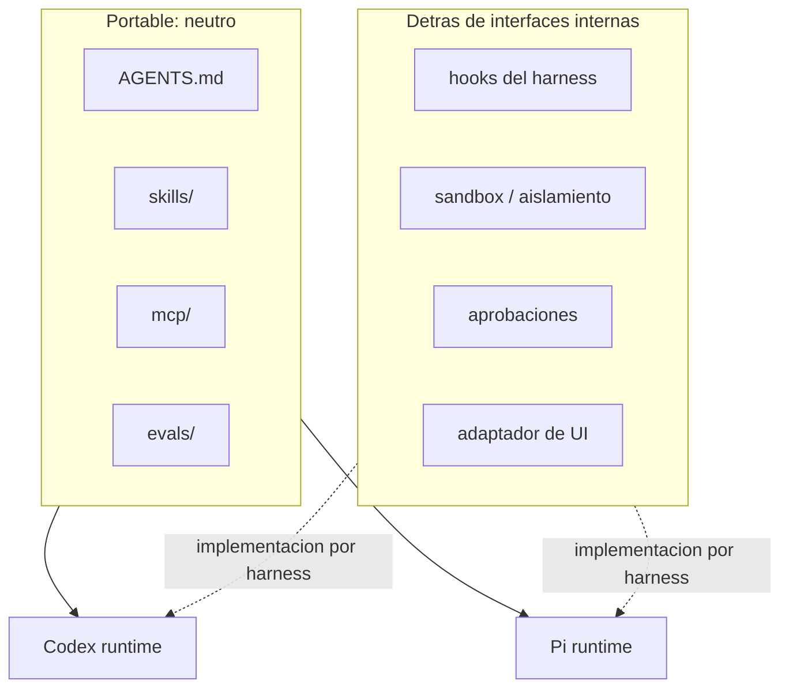
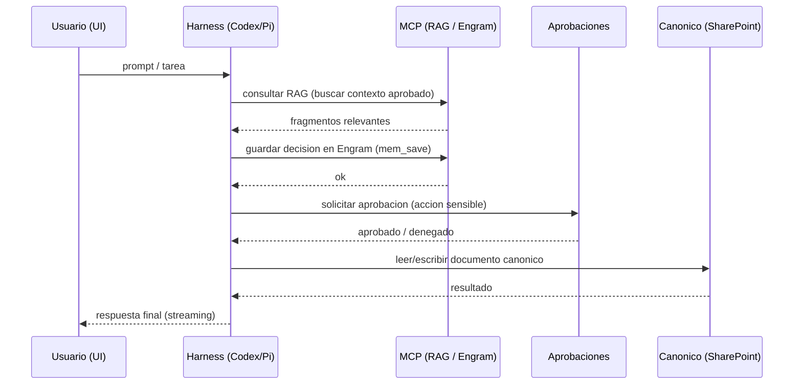

# Infraestructura de agentes: Codex vs Pi Agent Harness

> **Decisión sobre el runtime de agentes para la plataforma de ingeniería asistida.**

| Campo | Valor |
| ------- | ------- |
| **Estado** | Borrador para presentación a panel (revisión de decisiones) |
| **Fecha** | 21 de agosto de 2026 |
| **Audiencia** | Panel de ingeniería/ejecutivo, mayormente no experto en IA |
| **Decisión recomendada** | Estrategia de dos pistas: prototipo time-boxed en **Codex** + spike de paridad en **Pi Agent Harness** → decisión formal por medición |
| **Base candidata provisional** | **Pi** como runtime propio eventual; **Codex** como acelerador de prototipo |
| **Deuda explícita** | No incorporar **LangGraph** al inicio; dejar una puerta condicional |

---

## 1. Resumen ejecutivo y decisión recomendada

**La recomendación es una estrategia, no una elección apresurada de tecnología.** El objetivo de producto ya no se sirve con n8n: pasamos de un backend monolítico de 3.410 líneas a una **aplicación propia de tipo NotebookLM** para ingenieros, donde **SharePoint es la fuente canónica de los PDF aprobados**, **PostgreSQL/pgvector es un índice RAG derivado y desechable**, y **Engram** es la memoria de agente/proyecto.

El problema central ya no es "cómo orquestamos un workflow visual", sino **"sobre qué runtime ejecutamos agentes que se comporten según nuestras reglas de ingeniería"**. Ese runtime se llama *harness*. Hay dos candidatos principales y una forma barata de elegir sin casarnos antes de tiempo:

- **Codex** (OpenAI): harness de código abierto, maduro, con `AGENTS.md`, Agent Skills, MCP, hooks, subagentes, aprobaciones y sandbox. Ideal para **probar el comportamiento del agente rápido**.
- **Pi Agent Harness** (`@earendil-works/pi-*`): harness mínimo en TypeScript/Bun, extensible, con SDK/RPC/JSON y **Engram como paquete de primera clase**. Mejor candidato para **poseer el runtime a largo plazo**, pero hoy sin MCP, permisos ni subagentes integrados.

**Decisión recomendada (dos pistas + puerta de medición):**

1. **Fase 0 — Contrato de portabilidad.** Escribir todo el comportamiento del agente en artefactos neutros (`AGENTS.md`, `.agents/skills/<name>/SKILL.md`, `mcp/`, `evals/`). El comportamiento queda *portable* entre harnesses.
2. **Pista A — Prototipo en Codex (time-box 2–4 semanas).** Probar el comportamiento (RAG MCP, Engram MCP, skills, evals) lo más rápido posible.
3. **Pista B — Spike de paridad en Pi (1–2 semanas).** Correr el *mismo* benchmark en Pi.
4. **Gate formal de decisión.** Elegir una base midiendo **paridad de tareas, costo, latencia, propiedad del código y portabilidad de proveedor**. Umbrales propuestos de gobernanza (no verdades universales): esfuerzo de paridad **`< 1,5×`** = Pi viable con fuerza; **`> 2,5×`** = retener Codex para el MVP; la zona **1,5×–2,5×** obliga a revisión del panel.
5. **No agregar LangGraph al inicio.** Se incorpora solo si aparece una necesidad **duradera** de orquestación multi-agente / multi-dominio.

> **Idea fuerza para el panel:** el comportamiento del agente es un activo de negocio que debemos poseer y versionar; el harness es una decisión de infraestructura que debemos poder cambiar sin reescribir ese activo. La estrategia de dos pistas compra esa libertad de cambio al menor costo.

---

## 2. Problema y contexto del proyecto

### 2.1 De dónde venimos

- El proyecto nació como una **plataforma RAG sobre n8n**, con una UI Streamlit inspirada en NotebookLM.
- n8n creció hasta convertirse en un **backend monolítico de 3.410 líneas** (`flows/n8n/Sistema-RAG-UI.json`) y dejó de ser el runtime objetivo. La conclusión del equipo es que n8n "no es la herramienta" para el nuevo rumbo.
- La UI actual (Streamlit, tipo NotebookLM) se valora y se quiere conservar como interfaz amigable para el usuario final.

### 2.2 Hacia dónde vamos

- **Producto:** aplicación propia, interactiva, tipo NotebookLM, orientada a **ingenieros** que quieren acelerar su trabajo asistido por IA.
- **Autoridad de datos:** **SharePoint** es la fuente canónica de los PDF aprobados.
- **Índice RAG:** **PostgreSQL + pgvector** es un índice **derivado y desechable** (se reconstruye; no es fuente de verdad).
- **Memoria:** **Engram** (y Engram Cloud) como memoria persistente de agente y de proyecto.
- **Infraestructura central:** puede correr en contenedores aislados.

### 2.3 Las dos ramas de implementación

El trabajo se divide naturalmente en dos planos que conviene **mantener separados**:

1. **Comportamiento del agente (el activo de negocio):** `AGENTS.md`, Agent Skills, RAG MCP, Engram MCP, evals. Responde a *"¿cómo debe pensar y comportarse el agente?"*.
2. **Infraestructura / harness (la decisión de runtime):** sesiones, modelos, tool loop, streaming, aprobaciones, sandbox, integración con la UI, persistencia, permisos y observabilidad. Responde a *"¿sobre qué ejecutamos ese comportamiento?"*.

La propuesta de dos pistas mapea exactamente a estos dos planos: probar el comportamiento rápido en un harness maduro (Codex) mientras se evalúa poseer el runtime (Pi).

---

## 3. Glosario introductorio para no especialistas

> Cada término incluye un ejemplo concreto del proyecto para anclar la abstracción.

### 3.1 Términos fundamentales

| Término | Qué es | Ejemplo en este proyecto |
| --------- | -------- | -------------------------- |
| **LLM / modelo** | Un modelo de lenguaje (GPT, Claude, Gemini…). Recibe texto y devuelve texto. No tiene memoria ni ejecuta acciones por sí solo. | El modelo que responde en la UI. Puede ser OpenAI, Anthropic u otro proveedor. |
| **Agente** | Un sistema que **usa un LLM + herramientas + un bucle** para cumplir una tarea. El LLM decide qué herramienta llamar y cuándo terminar. | El "asistente de ingeniería" que lee un PDF aprobado, busca contexto y redacta una respuesta. |
| **Bucle de agente (agent loop)** | El ciclo repetido: (1) el LLM decide una acción, (2) se ejecuta la herramienta, (3) el resultado vuelve al LLM, hasta que decide responder. | El agente lee el repositorio, consulta RAG, guarda una decisión en Engram y responde. |
| **Subagente** | Un agente **secundario** que un agente principal delega para una subtarea, con su propio contexto. | Delegar "analiza este documento" a un agente especializado y devolver un resumen. |
| **Agent Skill** | Un **paquete de instrucciones + archivos auxiliares** que el agente carga **bajo demanda** para una tarea específica. Es documentación ejecutable, no código del harness. | Una skill `pdf-extraction` con `SKILL.md` y un script que el agente invoca solo al tratar PDFs. |
| **Herramienta (tool)** | Una **función concreta** que el LLM puede invocar (leer archivo, ejecutar bash, llamar un MCP). | `read`, `bash`, `mem_save`, `rag_search`. |
| **MCP (Model Context Protocol)** | Un **protocolo estándar** para conectar agentes con herramientas/datos externos. Tiene **cliente** (el agente) y **servidor** (quien expone las herramientas). | Un **servidor MCP de RAG** que expone `rag_search`; un **servidor MCP de Engram** que expone `mem_save`/`mem_search`. |
| **Harness** | El **runtime** que ejecuta el bucle del agente: gestiona sesiones, modelos, herramientas, streaming, permisos. No es el modelo ni el comportamiento. | **Codex** o **Pi**. |
| **Agent engineering / "ingenieriar un agente"** | La disciplina de **diseñar el comportamiento**: prompts, skills, herramientas y evals. Distinta de "escribir el harness". | Redactar `AGENTS.md`, escribir skills, medir con evals. |
| **RAG (Retrieval-Augmented Generation)** | Técnica que **recupera fragmentos relevantes** de un índice y se los da al modelo como contexto antes de responder. | Buscar en pgvector los fragmentos del PDF aprobado y pasarlos al modelo. |
| **Sandbox / contenedor** | **Aislamiento de ejecución**: limita qué archivos, red y procesos puede tocar el agente. | Correr el agente en un contenedor que solo ve el workspace y el índice RAG. |

### 3.2 Tres distinciones que evitan errores costosos

**1. Un agente no es simplemente un prompt.**
Un prompt es una instrucción de texto. Un agente es un **sistema en ejecución**: modelo + herramientas + bucle + estado + permisos. Cambiar el prompt no cambia el bucle; "agente" implica comportamiento, no solo redacción.

**2. Una skill no es un subagente.**

- Una **skill** es **conocimiento empaquetado** (instrucciones + archivos) que el agente principal *lee* y sigue. No ejecuta nada por sí misma; es contenido.
- Un **subagente** es un **proceso independiente** con su propio bucle y contexto, que se **delega**.
- Confundirlos lleva a sobre-arquitectura (crear subagentes donde bastaba una skill) o a infra-diseño (meter lógica de proceso en una skill que debería ser un componente ejecutable).

**3. Memoria ≠ estado de workflow ≠ registro canónico.**

- **Memoria (Engram):** conocimiento persistente entre sesiones ("qué decidimos", "qué aprendimos"). Cualitativo y reutilizable.
- **Estado de workflow (sesión del harness / LangGraph):** el estado transitorio de una ejecución en curso (mensajes, pasos, checkpoint). Volátil por diseño.
- **Registro canónico (SharePoint):** la **fuente de verdad** de los documentos aprobados. No se deriva de memoria ni de RAG; es el origen.

---

## 4. Arquitectura por capas y separación de responsabilidades

La plataforma se describe como capas que **no deben mezclarse**. Cada capa tiene una responsabilidad única y una frontera de reemplazo.

| Capa | Responsabilidad | Implementación candidata |
| ------ | ----------------- | -------------------------- |
| **Producto / UI** | Interfaz tipo NotebookLM para el usuario final | Streamlit (hoy) o web app propia |
| **Dominio / backend** | Lógica de negocio, reglas de ingeniería, APIs | Servicio propio (Python/TS) |
| **Comportamiento del agente** | Reglas de comportamiento, skills, evals | `AGENTS.md`, `.agents/skills/`, `evals/` |
| **Harness / runtime** | Bucle, sesiones, modelos, streaming, permisos | **Codex** o **Pi** |
| **Herramientas / MCP** | Capacidades externas expuestas al agente | MCP RAG, MCP Engram, MCP SharePoint |
| **Conocimiento / RAG** | Índice vectorial derivado de documentos aprobados | PostgreSQL + pgvector |
| **Memoria / Engram** | Memoria persistente de agente/proyecto | Engram local / Engram Cloud |
| **Canónico / SharePoint** | Fuente de verdad de PDF aprobados | SharePoint |
| **Ejecución aislada** | Aislamiento de herramientas y comandos | Contenedores / sandbox |

**Regla de oro:** lo que vive en "comportamiento del agente" debe ser **portable**; lo que vive en "harness/runtime" y "ejecución aislada" debe quedar **detrás de interfaces internas**, para poder cambiar de Codex a Pi (o viceversa) sin tocar el comportamiento.



*La flecha punteada `RAG deriva de SharePoint` es la afirmación más importante: el índice vectorial es un derivado reconstruible, no la autoridad.*

---

## 5. Codex en detalle

### 5.1 Qué es

Codex es un **agente de codificación de OpenAI que corre localmente**. Tiene dos piezas que hay que separar con cuidado:

- **El harness de código abierto** (repositorio `openai/codex`, licencia Apache-2.0): el runtime del agente, escrito principalmente en Rust (`codex-rs`). Se puede inspeccionar, construir y extender.
- **Los servicios administrados / modelo de OpenAI** (plan ChatGPT o API key): el **modelo** y la **autenticación** que usa el harness. Son la parte acoplada al proveedor.

> **Acoplamiento delicado:** el harness es abierto, pero el *producto* Codex está optimizado para los modelos de OpenAI. Usarlo con otro proveedor es posible vía configuración/MCP, pero la experiencia "de fábrica" apunta a OpenAI. Esto es un punto central del tradeoff de **portabilidad de proveedor**.

### 5.2 Superficie de extensión (lo que aprovecharíamos)

| Mecanismo | Qué hace | Relevancia |
| ----------- | ---------- | ------------ |
| **`AGENTS.md`** | Archivo de configuración del agente: reglas, contexto y convenciones del proyecto. | El corazón del **comportamiento portable**. |
| **Agent Skills** | Paquetes `SKILL.md` cargados bajo demanda (progressive disclosure). | Reutilización de capacidades y portabilidad. |
| **MCP** | Conexión de servidores MCP (RAG, Engram, etc.) como herramientas. | Acceso a RAG y Engram. |
| **Hooks** | Ganchos de ciclo de vida (antes/después de turnos, herramientas, etc.). | Política, logging, validación. |
| **Subagentes** | Delegación de subtareas a agentes secundarios. | Paralelismo y especialización. |
| **Aprobaciones / permisos** | Control de acciones sensibles (red, filesystem) con confirmación del usuario. | Gobierno de seguridad. |
| **Sandbox** | Aislamiento del entorno de ejecución (incluye Windows sandbox). | Ejecución aislada. |
| **app-server / SDK** | Protocolo (JSON-RPC sobre stdio/websocket/unix) y SDK para incrustar Codex en un producto. | Integración con nuestra UI. |
| **Streaming / sesiones** | Modelo thread → turn → item con eventos incrementales. | UX en tiempo real. |

### 5.3 Ciclo de vida de sesión (app-server)

El app-server modela la conversación en tres niveles anidados: **thread** (conversación) → **turn** (una petición + trabajo del agente) → **item** (unidad de entrada/salida). El protocolo es JSON-RPC 2.0 y los transportes soportados son:

- **`stdio`** (por defecto): JSONL sobre entrada/salida estándar.
- **`unix://`**: WebSocket sobre un socket Unix local.
- **`websocket` (`ws://`/`wss://`)**: **experimental y no soportado para producción**.

> **⚠️ Advertencia de producción.** La documentación oficial es explícita: *"The app-server command and WebSocket transport are experimental and aren't supported for production workloads."* Para integración en producción, la vía segura es **stdio o socket Unix local**, no el WebSocket remoto.

### 5.4 Fortalezas y limitaciones

**Fortalezas**

- Harness maduro y de código abierto con una superficie de extensión amplia y documentada.
- `AGENTS.md`, Skills y MCP alineados con los estándares que ya queremos adoptar (misma base de portabilidad que Pi).
- Aprobaciones, permisos, sandbox y subagentes **integrados** (sin tener que construirlos).
- app-server/SDK pensados para incrustar el agente en un producto (auth, historial, aprobaciones, eventos).

**Limitaciones**

- Acoplamiento natural al ecosistema de modelos OpenAI (portabilidad de proveedor limitada "de fábrica").
- El transporte WebSocket del app-server es **experimental**; la integración robusta es por stdio/socket local.
- Menos control sobre el bucle interno: si necesitamos reescribir el runtime, no es el camino de "poseerlo".

### 5.5 Cuándo usarlo y cuándo no

- **Conviene:** prototipar el **comportamiento** rápido; validar skills/MCP/evals; cuando la velocidad de puesta en marcha pesa más que la propiedad del runtime; cuando ya hay inversión en el ecosistema OpenAI.
- **No conviene:** como runtime **propio** a largo plazo si la portabilidad de proveedor y el control total del bucle son requisitos; o si el equipo no quiere depender del acoplamiento OpenAI.

---

## 6. Pi Agent Harness en detalle

### 6.1 Qué es

Pi es un **harness de codificación mínimo en terminal**, escrito en **TypeScript y empaquetado con Bun**, distribuido como monorepo npm bajo `@earendil-works/*` (MIT). Su filosofía declarada es **mantener el núcleo pequeño** y extenderlo vía TypeScript.

**Paquetes relevantes:**

| Paquete | Rol |
| --------- | ----- |
| **`@earendil-works/pi-ai`** | API unificada de LLM multi-proveedor (OpenAI, Anthropic, Google, etc.). |
| **`@earendil-works/pi-agent-core`** | Runtime del agente: tool calling y gestión de estado. |
| **`@earendil-works/pi-coding-agent`** | CLI interactivo **y SDK programático** (el SDK no es un paquete separado). |
| `pi-telemetry`, `pi-tui` | Contratos de telemetría y librería de TUI. |

> **Dato de precisión:** la API programática de Pi **no es un paquete aparte**; vive en `pi-coding-agent` (`createAgentSession`, `ModelRuntime`, `SessionManager`, `SettingsManager`, etc.). "El SDK está incluido en el paquete principal."

### 6.2 Tres modos de integración

| Modo | Qué es | Cuándo |
| ------ | -------- | -------- |
| **SDK** (`createAgentSession`) | Incrustar el agente **en proceso** en una app Node/TS. | Integración nativa, tipado fuerte, acceso al estado. |
| **RPC** (`pi --mode rpc`) | Protocolo JSON sobre **stdin/stdout** (JSONL). | Integración desde otro lenguaje o subproceso. |
| **JSON event stream** (`pi --mode json`) | Eventos JSON en stdout para pipelines/UI. | Streaming simple hacia la UI. |

El modo RPC expone comandos (`prompt`, `steer`, `follow_up`, `abort`, `get_state`, `get_messages`, `compact`, `bash`, `get_session_stats`, `fork`, etc.) y **eventos** ricos (`agent_start`/`agent_end`/`agent_settled`, `turn_start`/`turn_end`, `message_start`/`message_update`/`message_end`, `tool_execution_start`/`update`/`end`, `compaction_start`/`end`, `auto_retry_*`), con un **sub-protocolo de UI de extensiones** (`select`, `confirm`, `input`, `editor`) que permite pedir interacción al usuario.

### 6.3 Capacidades de extensión

- **Skills:** implementa el **estándar Agent Skills** (`SKILL.md` con frontmatter), con *progressive disclosure*. Descubre desde `.agents/skills/` (proyecto y global) y `.pi/skills/`. Incluso puede **reutilizar skills de Claude Code o Codex** (`~/.claude/skills`, `~/.codex/skills`).
- **Extensiones:** módulos TypeScript que registran **herramientas** (`pi.registerTool`), **comandos**, **eventos** y **UI**. Sirven para construir *gates de permisos* (confirmar antes de `rm -rf`), hooks de ciclo de vida, compaction custom, etc.
- **Herramientas custom:** `defineTool()` con schemas TypeBox.
- **Proveedores custom:** `registerProvider()` para modelos propios o compatibles.
- **Sesiones y compactación:** sesiones como **árbol** (`id`/`parentId`) con branching; **compactación** de contexto (manual o automática) con resumen.
- **Engram de primera clase:** el paquete `gentle-engram` conecta Pi con Engram (memoria persistente, recuperación de compactación, memoria compartida entre agentes).

### 6.4 Omisiones actuales (explícitas, no accidentales)

Pi **no incluye de fábrica**:

- **MCP integrado** → se requiere un adaptador/paquete (p. ej. `pi-mcp-adapter`) o extenderlo.
- **Sistema de permisos** → no hay restricción integrada de filesystem/proceso/red/credenciales; corre con los permisos del usuario.
- **Subagentes integrados** → no hay una primitiva de subagente de fábrica.
- **Sandbox integrado** → "Pi no incluye un sandbox integrado"; el aislamiento real debe venir del **SO o de un contenedor/VM**.

> **Contraparte:** la documentación de Pi es directa al respecto — el aislamiento debe provenir del sistema operativo o de un límite de virtualización/contenedor. Patrones oficiales: **Gondolin** (micro-VM local), **Docker plano** (todo el proceso en contenedor) y **OpenShell** (sandbox con políticas).

### 6.5 Fortalezas y limitaciones

**Fortalezas**

- Núcleo pequeño y **extensible** en TypeScript: SDK/RPC/JSON para incrustarlo donde queramos.
- **Portabilidad de proveedor**: `pi-ai` abstrae múltiples proveedores (OpenAI, Anthropic, Google, custom). Un solo punto de conexión para todos los usuarios.
- **Engram de primera clase** (memoria persistente).
- Sesiones con branching y compactación, alineadas con el ciclo de vida del agente.
- MIT + comunidad activa; instalación simple (`npm install -g @earendil-works/pi-coding-agent`).

**Limitaciones**

- **Sin MCP, permisos ni subagentes integrados**: hay que construirlos o adaptarlos (costo de implementación).
- **Sin sandbox integrado**: el aislamiento es responsabilidad nuestra (contenedores).
- Menos "caja cerrada" que Codex: más control implica más código propio.

### 6.6 Cuándo usarlo y cuándo no

- **Conviene:** cuando queremos **poseer el runtime** y el bucle; portabilidad de proveedor; integración profunda vía SDK/RPC; Engram como memoria de primera clase; TypeScript como stack.
- **No conviene:** si no queremos construir MCP/permisos/subagentes/sandbox; si el time-to-prototype es la prioridad absoluta y Codex ya lo resuelve.

---

## 7. LangGraph, explicado con precisión

### 7.1 Qué es (y qué no es)

LangGraph es un **framework/runtime de orquestación de bajo nivel** (Python) para construir **workflows/agentes con estado y larga duración**. Sus capacidades centrales son:

- **Ejecución durable:** el grafo persiste y puede **reanudarse** tras fallos.
- **Checkpointers:** el mecanismo de persistencia que guarda el estado del grafo en cada paso.
- **Interrupt / resume / HITL (human-in-the-loop):** pausar el grafo en un punto, esperar entrada externa y continuar con `Command(resume=...)`.
- **Streaming y memoria**, mezclando pasos deterministas con pasos agenticos en un mismo grafo.

> **No es un harness de codificación.** LangGraph **no** es Codex ni Pi: no trae el bucle de codificación, las herramientas de filesystem/shell, ni el runtime de edición de código. El "agent harness" de LangChain sobre LangGraph es otro producto (**Deep Agents**). Presentar LangGraph "debajo" de Pi o Codex es conceptualmente incorrecto.

### 7.2 Por qué es un orquestador *alternativo/externo*, no la base de Pi

Pi **ya es un harness**: tiene su propio bucle, sesiones, compactación y eventos. LangGraph sería un **orquestador por encima o al costado**, no el fundamento de Pi. Mezclarlos introduce una **frontera de proceso Python ↔ TypeScript** y **duplica** responsabilidades que cada lado ya tiene:

- **Persistencia duplicada:** Pi persiste sesiones (árbol JSONL + compactación); LangGraph persiste estado del grafo (checkpointer). Dos modelos de estado conviviendo.
- **HITL duplicado:** Pi tiene aprobaciones vía extensiones/UI (`ctx.ui.confirm`); LangGraph tiene `interrupt()`/resume. Dos mecanismos de pausa.



### 7.3 Cuándo el híbrido Pi + LangGraph se justifica (y cuándo es sobre-ingeniería)

- **Se justifica** cuando aparece una necesidad **duradera** de orquestación **multi-agente / multi-dominio**: workflows que atraviesan varios agentes y sistemas, con pasos de aprobación en medio, que deben sobrevivir a reinicios y correr por horas/días.
- **Es sobre-ingeniería** en la fase actual: para "un agente + RAG + memoria + UI" no hay un grafo cross-agent que orquestar. Agregar LangGraph ahora duplica persistencia y HITL, agrega una frontera de proceso y dos modelos de estado sin beneficio medible. Por eso la puerta de LangGraph es **condicional**.

---

## 8. Compatibilidad de Engram con ambas pistas

### 8.1 Qué es Engram (y qué no es)

Engram es un **sistema de memoria persistente para agentes**: un **binario Go** con **SQLite + FTS5**, expuesto vía CLI, HTTP API, **servidor MCP** y TUI. Es **agent-agnóstico**: funciona con Codex, Pi, Claude Code, OpenCode, Gemini CLI, etc., vía `engram setup <agent>`.

- **Transporte MCP: stdio** (`engram mcp` habla MCP sobre stdin/stdout). **No hay MCP sobre HTTP/TCP**.
- **Almacenamiento local:** SQLite en `~/.engram/engram.db` (fuente de verdad local).
- **Engram Cloud:** replicación **opt-in y project-scoped** + dashboard; la SQLite local sigue siendo la autoridad.

### 8.2 Cómo encaja en cada pista

| Pista | Integración |
|-------|-------------|
| **Codex** | `engram setup codex` conecta Engram como servidor MCP stdio. El agente usa `mem_save`, `mem_search`, `mem_session_summary`, etc. |
| **Pi** | Paquete de primera clase `gentle-engram` (+ `pi-mcp-adapter`). Expone herramientas `mem_*` nativas de Pi y captura de sesión/compactación vía el servidor HTTP local. |

En ambos casos, **la memoria es la misma**: la misma SQLite local, y el mismo Engram Cloud project-scoped cuando se active. Esto refuerza la portabilidad: **el comportamiento (skills/AGENTS.md) y la memoria (Engram) sobreviven al cambio de harness**.

### 8.3 Separaciones que hay que respetar

- **Engram ≠ estado de sesión.** Engram guarda conocimiento durable entre sesiones; el estado de sesión es del harness (Codex thread/turn o Pi session tree).
- **Engram ≠ RAG documental.** Engram **no es** un almacén documental ni un RAG sobre PDFs. Es memoria de decisiones/descubrimientos/preferencias.
- **Engram ≠ registro canónico.** El canónico documental es SharePoint; Engram es memoria de proceso, no la fuente de verdad de los documentos.

---

## 9. Matriz comparativa Codex vs Pi

Puntuación cualitativa: **●** débil, **●●** aceptable, **●●●** fuerte. No usa popularidad de GitHub como evidencia de madurez (esa métrica se descarta explícitamente).

### 9.1 Para el prototipo (velocidad de validación del comportamiento)

| Criterio | Codex | Pi | Nota |
| ---------- | ------- | ---- | ------ |
| Velocidad de puesta en marcha | ●●● | ●● | Codex trae todo integrado. |
| Skills / `AGENTS.md` | ●●● | ●●● | Ambos siguen el estándar Agent Skills. |
| MCP listo para usar | ●●● | ● | Pi requiere adaptador. |
| Aprobaciones integradas | ●●● | ●● | Pi vía extensiones (`ctx.ui.confirm`). |
| Sandbox integrado | ●●● | ● | Pi delega en contenedores/VM. |
| Subagentes | ●●● | ● | No integrados en Pi. |
| Streaming/eventos para la UI | ●●● | ●●● | app-server (stdio) vs RPC/JSON. |

### 9.2 Para el producto (propiedad, control, portabilidad)

| Criterio | Codex | Pi | Nota |
| ---------- | ------- | ---- | ------ |
| Propiedad del runtime | ●● | ●●● | Pi es MIT y extensible por diseño. |
| Portabilidad de proveedor | ●● | ●●● | `pi-ai` abstrae proveedores. |
| Control del bucle interno | ●● | ●●● | Pi expone SDK/estado. |
| Costo de integración profunda | ●● | ●● | Codex: transporte experimental; Pi: construir permisos/MCP. |
| Madurez del ecosistema | ●●● | ●● | Codex más completo "de fábrica". |
| Memoria de primera clase | ●● | ●●● | Engram es paquete de primera clase en Pi. |

### 9.3 Ponderación propuesta (para el gate)

| Dimensión | Peso propuesto | Razón |
| ----------- | ---------------- | ------- |
| Paridad de tareas en el benchmark | 35% | El comportamiento es el activo. |
| Propiedad del runtime | 25% | Decisión estratégica de largo plazo. |
| Portabilidad de proveedor | 15% | Evitar lock-in de modelo. |
| Costo + latencia | 15% | Viabilidad operativa. |
| Esfuerzo de implementación (horas) | 10% | Tiempo de equipo. |

> Los pesos son **propuesta de gobernanza**, no hechos: el panel debe validarlos o ajustarlos antes del gate.

---

## 10. Pros / contras y "conviene / no conviene"

### 10.1 Codex

**Pros**

- Maduro, integrado, con la superficie completa (AGENTS.md, Skills, MCP, hooks, subagentes, aprobaciones, sandbox).
- app-server/SDK para incrustar en producto.
- Velocidad de prototipo máxima.

**Contras**

- Acoplamiento natural a OpenAI (portabilidad de proveedor limitada).
- WebSocket del app-server experimental; producción por stdio/unix.
- Menor control/posesión del runtime.

- **Conviene** como **acelerador de prototipo** y como **base del MVP** si la paridad de Pi supera el umbral alto.
- **No conviene** como **runtime propio de largo plazo** si la portabilidad de proveedor y el control del bucle son estratégicos.

### 10.2 Pi

**Pros**

- Runtime propio, extensible, con SDK/RPC/JSON.
- Portabilidad de proveedor vía `pi-ai`.
- Engram de primera clase.
- MIT, TypeScript/Bun, sesiones con branching/compaction.

**Contras**

- Sin MCP, permisos, subagentes ni sandbox integrados (costo de construcción).
- Más control implica más código propio.
- Ecosistema menos "llave en mano" que Codex.

- **Conviene** como **runtime propio eventual** y para integración profunda con la UI.
- **No conviene** si no queremos asumir el costo de construir permisos/MCP/aislamiento.

### 10.3 LangGraph + Pi (híbrido)

**Pros**

- Orquestación durable multi-agente/multi-dominio con checkpointers e interrupt/resume.
- Mezcla pasos deterministas y agenticos.

**Contras**

- Frontera de proceso Python ↔ TypeScript.
- Duplica persistencia y HITL (checkpointer vs sesión Pi; `interrupt` vs `ctx.ui.confirm`).
- Complejidad sin beneficio en la fase actual.

- **Conviene** solo si aparece orquestación **cross-agent durable** probada como necesaria.
- **No conviene** como fundamento inicial; es un orquestador **externo**, no la base de Pi.

---

## 11. Contrato de portabilidad

### 11.1 Qué se transfiere sin cambios

| Artefacto | ¿Portable? | Nota |
| ----------- | ------------ | ------ |
| `AGENTS.md` | **Sí** | Ambos harnesses lo leen como contexto. |
| `.agents/skills/<name>/SKILL.md` | **Sí** | Estándar Agent Skills; Pi incluso puede leer skills de Codex. |
| `mcp/` (definiciones de servidores MCP) | **Sí** (con matiz) | Codex los consume nativo; Pi necesita adaptador. El *contrato* es portable, el *mecanismo* no. |
| `evals/` | **Sí** | Harness-agnostic por diseño. |
| Memoria Engram | **Sí** | La misma SQLite/Cloud en ambos. |
| Datos RAG (pgvector) | **Sí** | Independiente del harness. |
| Canónico SharePoint | **Sí** | Fuente externa al harness. |

### 11.2 Qué NO se transfiere (detrás de interfaces internas)

| Componente | ¿Por qué no es portable? |
| ------------ | -------------------------- |
| Hooks del harness | Cada harness tiene su propio modelo de hooks. |
| Sandbox / aislamiento | Codex lo integra; Pi lo delega a contenedores. |
| Aprobaciones | Codex nativas; Pi vía extensiones. |
| Adaptador de UI | app-server (Codex) vs SDK/RPC (Pi). |

> **Principio:** hooks, sandbox, aprobaciones y adaptadores de UI deben implementarse **detrás de interfaces internas** (un contrato nuestro), de modo que cambiar de harness sea reimplementar el adaptador, no reescribir el comportamiento.

### 11.3 Árbol de directorios neutro propuesto

```text
<repo>/
├── AGENTS.md                        # Reglas de comportamiento (neutro)
├── .agents/
│   └── skills/
│       ├── <nombre>/
│       │   ├── SKILL.md             # Frontmatter + instrucciones
│       │   ├── scripts/             # Código auxiliar
│       │   └── references/          # Docs cargadas on-demand
│       └── ...
├── mcp/                             # Definiciones de servidores MCP (RAG, Engram, SharePoint)
│   ├── rag/
│   ├── engram/
│   └── sharepoint/
├── evals/                           # Benchmarks harness-agnostic
│   ├── cases/
│   └── metrics/
├── harness/                         # Adaptadores NO portables (interfaces internas)
│   ├── codex/                       #   hooks, sandbox, aprobaciones, UI adapter
│   └── pi/
├── app/                             # Producto/UI + dominio
└── infra/                           # Contenedores, RAG (pgvector), SharePoint sync
```

### 11.4 Estándar Agent Skills y progressive disclosure

El estándar **Agent Skills** (`agentskills.io/specification`) define una skill como un directorio con `SKILL.md` (YAML frontmatter + Markdown). Frontmatter obligatorio: `name` (máx 64 chars, minúsculas/guiones, debe coincidir con el nombre del directorio) y `description` (máx 1024 chars). Opcionales: `license`, `compatibility`, `metadata`, `allowed-tools` (experimental).

La **progressive disclosure** (divulgación progresiva) es el mecanismo de carga en tres niveles:

1. **Metadata (~100 tokens):** `name` + `description` se cargan siempre al inicio, para que el agente sepa *cuándo* activar la skill.
2. **Instrucciones (< 5.000 tokens recomendado, < 500 líneas):** el cuerpo de `SKILL.md` se carga al activar la skill.
3. **Recursos (on-demand):** archivos de `scripts/`, `references/`, `assets/` se cargan solo cuando se necesitan.

> **Implicación práctica:** escribimos skills **cortas** con `description` específico, y movemos el detalle a `references/`. Esto reduce el consumo de contexto y hace que la skill funcione igual en Codex y en Pi (ambos implementan el estándar; Pi es algo más tolerante en la validación).

---

## 12. Diagramas

Cada diagrama se introduce en prosa y se explica al pie.

### 12.1 Arquitectura de capas

Ya presentado en la Sección 4 (diagrama de capas). Resume la separación producto/dominio/comportamiento/harness/herramientas/RAG/memoria/canónico/aislamiento, con la flecha punteada `RAG deriva de SharePoint`.

### 12.2 Anatomía de un agente / flujo del harness

Muestra el bucle interno que ejecuta cualquier harness (Codex o Pi): el LLM decide, la herramienta se ejecuta, el resultado regresa, hasta la respuesta final, con políticas/permisos al costado y compactación de contexto.



### 12.3 Estrategia de dos pistas y decisión de convergencia

Representa el plan: contrato de portabilidad → dos pistas → benchmark común → gate → elección de base.



### 12.4 Frontera de portabilidad

Separa lo **portable** (comportamiento) de lo **no portable** (adaptadores del harness), mostrando que ambos runtimes consumen el mismo comportamiento neutro.



### 12.5 Secuencia: UI → harness → MCP RAG/Engram → aprobación → resultado

Muestra el recorrido de una petición real, incluyendo la consulta al RAG, la escritura de memoria en Engram, la aprobación de una acción sensible y la respuesta final con streaming.



### 12.6 Híbrido LangGraph + Pi: por qué agrega complejidad

Presentado en la Sección 7.2. Muestra la frontera de proceso Python ↔ TypeScript y la duplicación de estado/HITL/persistencia, que es el argumento central para **no** adoptarlo al inicio.

---

## 13. Plan por fases recomendado

| Fase | Duración | Objetivo | Salida |
| ------ | ---------- | ---------- | -------- |
| **Fase 0 — Contrato de portabilidad** | ~1 semana | Fijar `AGENTS.md`, estructura `skills/`, `mcp/`, `evals/` e interfaces internas de harness. | Árbol de directorios y contrato congelado. |
| **Codex time-box** | 2–4 semanas | Prototipo de comportamiento en Codex (RAG MCP, Engram MCP, skills, evals). | Prototipo funcional + benchmark. |
| **Pi parity spike** | 1–2 semanas | Correr el **mismo** benchmark en Pi (SDK o RPC). | Métricas de paridad. |
| **Gate formal de decisión** | 1 sesión de panel | Medir paridad, costo, latencia, propiedad, portabilidad. | Base elegida (Pi o Codex). |
| **Productización** | continúa | Endurecer la base elegida: permisos, aislamiento, UI, observabilidad. | Plataforma operativa. |
| **Puerta condicional de LangGraph** | solo si aplica | Si aparece orquestación cross-agent durable. | Decisión de incorporar LangGraph o no. |

---

## 14. PoCs y métricas concretas

Cada PoC debe medirse con un número, no con impresiones.

| PoC | Qué mide | Métrica objetivo |
| ----- | ---------- | ------------------ |
| **RAG MCP: calidad** | Precisión de respuestas basadas en PDF aprobados. | Tasa de acierto en evals de referencia; nº de alucinaciones. |
| **RAG MCP: ACL leakage** | Que el índice no devuelva fragmentos de proyectos sin permiso. | 0 fugas en el test de ACL (filtro por `user_id`/proyecto). |
| **Calidad de tarea del agente** | ¿Cumple la tarea de ingeniería de punta a punta? | Pass rate del benchmark de tareas. |
| **Recall de Engram** | ¿Recupera la memoria relevante tras sesión/compaction? | Recall@k en el set de memorias. |
| **Portabilidad de la misma skill** | ¿La misma `SKILL.md` funciona en ambos harnesses? | Pass rate idéntico (o delta medible) Codex vs Pi. |
| **Eventos Pi RPC/SDK** | ¿Los eventos llegan completos y ordenados a la UI? | 100% eventos correlacionados; 0 perdidos. |
| **Codex app-server stdio** | ¿Integración por stdio es estable (evitando WebSocket)? | Sin errores de transporte en la corrida. |
| **Evals harness-agnostic** | ¿El mismo eval corre en ambos sin cambios? | 100% reutilización del suite. |
| **Latencia** | Tiempo de primera respuesta y de tarea completa. | P50/P95 en ms por harness. |
| **Costo** | Tokens + costo por tarea. | $/tarea comparado entre harnesses y proveedores. |
| **Aprobaciones** | ¿Bloquea acciones sensibles correctamente? | 0 acciones sensibles sin aprobación. |
| **Horas de implementación** | Esfuerzo de construir lo que falta (Pi: MCP/permisos). | Horas registradas por componente. |
| **Recovery** | ¿Se recupera tras un fallo/corte? | Tiempo de recuperación + cero pérdida de estado crítico. |
| **Aislamiento** | ¿El agente toca solo lo permitido? | 0 accesos fuera del sandbox. |

> La métrica **paridad de esfuerzo** (`< 1,5×` / `> 2,5×`) se deriva de las horas de implementación y de la tasa de pass del benchmark, y es un **umbral propuesto**, no una ley.

---

## 15. Riesgos, anti-patrones y mitigaciones

| Riesgo / anti-patrón | Descripción | Mitigación |
| ---------------------- | ------------- | ------------ |
| **Dos codebases divergiendo** | Codex y Pi evolucionan por separado y el comportamiento se bifurca. | Contrato de portabilidad + evals comunes como freno; una sola fuente de verdad del comportamiento. |
| **Lógica de dominio en el harness** | Reglas de negocio escritas en hooks/extensiones del harness. | Mover la lógica de dominio al backend; el harness solo ejecuta comportamiento declarado. |
| **Estado duplicado** | Estado en harness + memoria + grafo (si se agrega LangGraph). | Fronteras claras: sesión (harness) ≠ memoria (Engram) ≠ canónico (SharePoint). |
| **Multi-agente prematuro** | Subagentes/orquestación antes de tener un agente que funcione. | Un solo agente primero; subagentes solo con caso probado. |
| **Confiar en RAG como fuente de verdad** | Tratar el índice vectorial como canónico. | SharePoint es la autoridad; pgvector es derivado y reconstruible. |
| **Sobre-exposición de herramientas MCP** | Exponer más herramientas de las necesarias → superficie de ataque y alucinación de tool-call. | Mínimo de herramientas por rol; validación de argumentos; ACL. |
| **Secretos** | API keys/credenciales en config o código del agente. | Variables de entorno, secret manager, nunca en `AGENTS.md`/skills. |
| **Vendor lock-in** | Quedar atado a OpenAI (Codex) o a un proveedor único. | Portabilidad de proveedor (Pi/`pi-ai`) y contrato neutro. |
| **Transportes experimentales** | Usar el WebSocket del app-server en producción. | stdio/unix socket para producción; WebSocket solo localhost/SSH-forwarded. |

---

## 16. Criterios de decisión y umbrales recomendados

**Criterios (ponderación propuesta en 9.3):**

1. Paridad de tareas en el benchmark (35%).
2. Propiedad del runtime (25%).
3. Portabilidad de proveedor (15%).
4. Costo + latencia (15%).
5. Esfuerzo de implementación en horas (10%).

**Umbrales (propuesta de gobernanza, no hechos universales):**

| Medición | Interpretación propuesta |
| ---------- | -------------------------- |
| Paridad de esfuerzo **`< 1,5×`** | Pi es **viable con fuerza**: el costo de poseer el runtime es bajo; elegir Pi. |
| Paridad de esfuerzo **`> 2,5×`** | Retener **Codex para el MVP**: poseer el runtime hoy es demasiado caro; reevaluar más adelante. |
| Zona **`1,5×`–`2,5×`** | **Revisión del panel**: decidir caso por caso con los pesos validados. |

> Estos umbrales son **política del proyecto**, no propiedades de las herramientas. Se etiquetan así para evitar presentarlos como hechos técnicos.

---

## 17. Recomendación final, checklist, próximos pasos y fuera de alcance

### 17.1 Recomendación final

Adoptar la **estrategia de dos pistas**: congelar el contrato de portabilidad, prototipar en Codex (time-box), medir paridad en Pi, y decidir la base por **paridad, costo, latencia, propiedad y portabilidad**. No incorporar LangGraph salvo que surja orquestación cross-agent durable. La base provisional favorece **Pi** como runtime propio, con **Codex** como red de seguridad y acelerador.

### 17.2 Checklist de decisión

- [ ] Contrato de portabilidad congelado (`AGENTS.md`, `skills/`, `mcp/`, `evals/`, interfaces internas).
- [ ] Benchmark común definido y versionado (mismo set de tareas para ambos harnesses).
- [ ] Prototipo Codex funcional (RAG MCP + Engram MCP + skills + evals).
- [ ] Spike Pi ejecutado con el mismo benchmark (SDK o RPC).
- [ ] Métricas recolectadas: paridad, costo, latencia, horas, recovery, aislamiento, ACL leakage.
- [ ] Umbrales de decisión validados por el panel.
- [ ] Base elegida documentada con la evidencia del gate.

### 17.3 Próximos pasos

1. Redactar y congelar el contrato de portabilidad (Fase 0).
2. Implementar el PoC de RAG MCP y Engram MCP en Codex.
3. Construir el benchmark de tareas y el suite de evals harness-agnostic.
4. Ejecutar el spike de paridad en Pi.
5. Convocar el gate de decisión con la evidencia.

### 17.4 Fuera de alcance (por ahora)

- Orquestación multi-agente/multi-dominio (LangGraph) hasta que se demuestre necesaria.
- Reemplazo del canónico documental (SharePoint) o del índice RAG (pgvector).
- Migración de la UI Streamlit a otra tecnología (se conserva y se integra, no se reescribe aún).
- Elección definitiva de proveedor de modelo (queda abierta; la portabilidad es el requisito, no un proveedor concreto).

---

## 18. Referencias

Fuentes oficiales consultadas el **21 de agosto de 2026**.

### Codex (OpenAI)

- <https://github.com/openai/codex>
- <https://developers.openai.com/codex/app-server>
- <https://developers.openai.com/codex/build-skills>
- <https://developers.openai.com/codex/agent-configuration/agents-md>
- <https://developers.openai.com/codex/extend/mcp>
- <https://developers.openai.com/codex/hooks>
- <https://developers.openai.com/blog/codex-as-a-platform>

### Pi Agent Harness

- <https://github.com/earendil-works/pi>
- <https://pi.dev/docs/latest>
- <https://pi.dev/docs/latest/sdk>
- <https://pi.dev/docs/latest/rpc>
- <https://pi.dev/docs/latest/json>
- <https://pi.dev/docs/latest/extensions>
- <https://pi.dev/docs/latest/skills>
- <https://pi.dev/docs/latest/security>
- <https://pi.dev/docs/latest/containerization>

### Engram

- <https://github.com/Gentleman-Programming/engram>
- <https://pi.dev/packages/gentle-engram>

### LangGraph

- <https://docs.langchain.com/oss/python/langgraph/overview>
- <https://docs.langchain.com/oss/python/langgraph/interrupts>

### Agent Skills

- <https://agentskills.io/specification>

---

## 19. Caveats factuales (calibración de afirmaciones)

- La **popularidad de GitHub no se usa** como evidencia de madurez; las matrices usan criterios funcionales.
- El **WebSocket del app-server de Codex es experimental y no soportado para producción** (afirmación de la documentación oficial); la vía segura es stdio/socket Unix.
- **Pi no incluye MCP, permisos ni subagentes integrados**, y **no incluye sandbox integrado**; el aislamiento es por contenedor/VM. Estas son omisiones **explícitas** de su documentación, no fallos accidentales.
- El **SDK de Pi no es un paquete separado**: la API programática vive en `pi-coding-agent`.
- **LangGraph no está debajo de Pi ni de Codex**; es un orquestador externo alternativo (y su "agent harness" propio es Deep Agents).
- **RAG (pgvector) no es la fuente de verdad**; SharePoint lo es. El índice es derivado y desechable.
- Los **umbrales `1,5×` / `2,5×` son propuestas de gobernanza**, no hechos universales.
